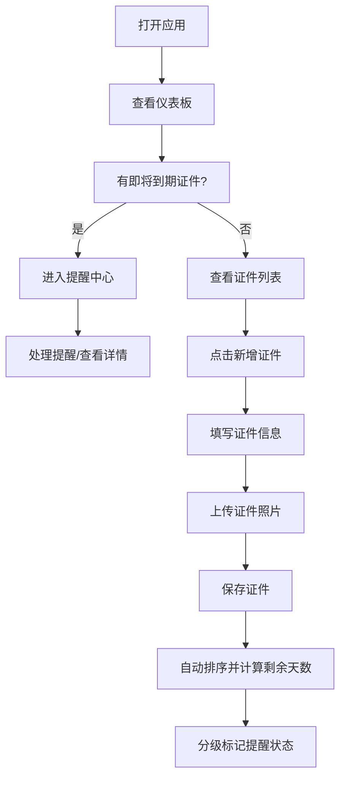

## 1. 产品概述

证件管理工具是一款面向家庭用户的证件信息管理系统，帮助用户统一管理家庭成员的各类重要证件，避免证件过期带来的不便，并支持证件照片电子化存档。

- 主要用途：集中录入、存储、管理家庭成员的各类证件信息，提供到期预警和照片存档功能
- 目标用户：需要管理家庭多成员证件的家庭用户
- 产品价值：解决证件分散管理、遗忘续期、证件丢失后无备份等痛点

## 2. 核心功能

### 2.1 用户角色

| 角色 | 注册方式 | 核心权限 |
|------|---------|---------|
| 家庭管理员 | 本地使用，无需注册 | 证件录入、编辑、删除、查看、照片管理 |

### 2.2 功能模块

1. **仪表板首页**：到期提醒概览、证件统计卡片、即将到期证件列表
2. **证件管理**：证件录入表单、证件列表展示、按有效期排序、证件详情/编辑/删除
3. **到期提醒中心**：分级提醒展示（90天/60天/30天/7天）、提醒状态管理
4. **家庭成员管理**：持证人信息维护、关联证件展示

### 2.3 页面详情

| 页面名称 | 模块名称 | 功能描述 |
|---------|---------|-----------|
| 仪表板首页 | 统计卡片 | 证件总数、即将到期数、已过期数、家庭成员数 |
| 仪表板首页 | 即将到期提醒 | 按紧急程度（红/橙/黄/绿）展示Top 5即将到期证件 |
| 仪表板首页 | 快捷操作入口 | 新增证件、查看全部证件、提醒中心入口 |
| 证件列表页 | 证件列表 | 卡片式展示，按有效期剩余天数升序排序 |
| 证件列表页 | 筛选排序 | 按证件类型/持证人筛选，按有效期/录入时间排序 |
| 证件列表页 | 搜索功能 | 按证件名称、持证人姓名、证件号码模糊搜索 |
| 证件录入/编辑 | 表单录入 | 证件类型下拉、持证人选择、证件号码脱敏显示、发证机关、有效期起止日期 |
| 证件录入/编辑 | 照片上传 | 支持多图上传、预览、删除 |
| 提醒中心页 | 分级提醒 | 90天（绿）、60天（黄）、30天（橙）、7天（红）四档提醒 |
| 提醒中心页 | 提醒处理 | 标记已处理、查看详情、快速续期备注 |

## 3. 核心流程

用户打开应用 → 查看仪表板的到期提醒 → 点击新增证件 → 填写证件信息并上传照片 → 保存后证件按有效期自动排序 → 系统根据剩余天数分级展示提醒 → 用户在提醒中心查看和处理到期证件

## 4. 用户界面设计

### 4.1 设计风格

- 主色调：深蓝（#1e3a5f）代表稳重可靠，搭配青色（#0ea5e9）作为强调色
- 紧急程度配色：7天红色（#ef4444）、30天橙色（#f97316）、60天黄色（#eab308）、90天绿色（#22c55e）
- 按钮样式：圆角大按钮，悬浮有微动画效果
- 字体：标题使用"Noto Serif SC"衬线体体现正式感，正文使用"PingFang SC"无衬线体保证可读性
- 布局风格：侧边栏导航 + 卡片式内容区，证件卡片使用玻璃拟态效果
- 图标：使用emoji图标配合证件类型（🆔护照、✈️港澳通行证、🚗驾驶证等）

### 4.2 页面设计概览

| 页面名称 | 模块名称 | UI元素 |
|---------|---------|--------|
| 仪表板首页 | 统计卡片 | 渐变背景卡片，带悬停浮起效果，数值动画滚动 |
| 仪表板首页 | 即将到期 | 紧急程度色块标记，倒计时徽章，进入倒计时的呼吸动画 |
| 证件列表页 | 证件卡片 | 左色块标识紧急程度，右上有效期徽章，底部缩略图预览 |
| 证件录入页 | 表单区域 | 分组标签式表单，日期选择器带日历弹出，证件类型图标联动切换 |
| 提醒中心页 | 提醒列表 | 时间线式布局，不同紧急度不同背景色，可展开显示详情 |

### 4.3 响应式设计

- 桌面端（默认）：侧边栏导航 + 双列/三列卡片网格
- 平板端：折叠侧边栏为图标栏，卡片改为双列
- 移动端：底部Tab导航，卡片单列全宽展示，优化触击区域
- 照片预览支持移动端手势缩放