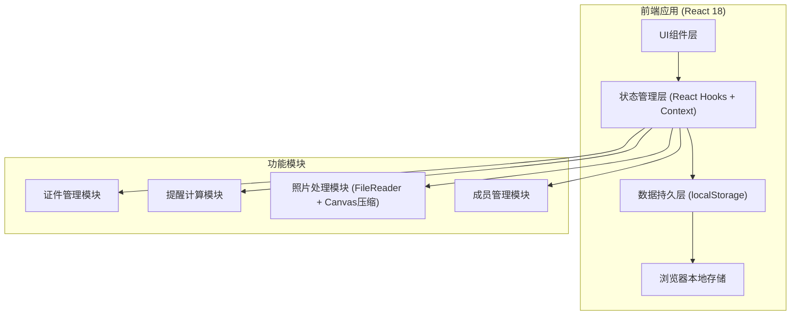
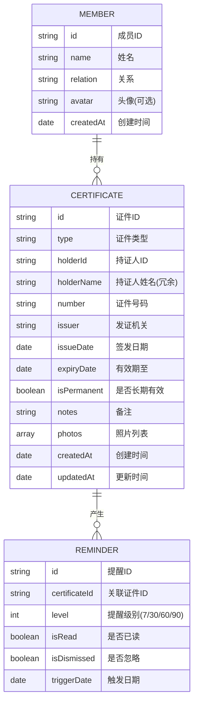

## 1. 架构设计



## 2. 技术描述

- **前端框架**: React 18 + TypeScript
- **构建工具**: Vite 5
- **样式方案**: TailwindCSS 3 + CSS Variables
- **状态管理**: React Hooks (useState, useEffect) + Context API
- **图标方案**: Lucide React
- **日期处理**: date-fns
- **数据持久化**: localStorage + IndexedDB (存储照片base64)
- **数据模拟**: 内置Mock数据，支持首次使用示例展示
- **部署方案**: 纯前端静态部署，无需后端服务

## 3. 路由定义

| 路由 | 页面组件 | 用途 |
|-----|---------|------|
| /dashboard | DashboardPage | 仪表板首页，展示统计概览和即将到期提醒 |
| /certificates | CertificateListPage | 证件列表页，支持筛选、排序、搜索 |
| /certificates/new | CertificateFormPage | 新增证件表单页 |
| /certificates/:id/edit | CertificateFormPage | 编辑证件表单页 |
| /certificates/:id | CertificateDetailPage | 证件详情页，展示照片和完整信息 |
| /reminders | ReminderCenterPage | 提醒中心页，分级展示所有到期提醒 |
| /members | MemberManagePage | 家庭成员管理页 |

## 4. 数据模型

### 4.1 数据模型定义



### 4.2 TypeScript 类型定义

```typescript
interface Member {
  id: string;
  name: string;
  relation: '本人' | '配偶' | '父亲' | '母亲' | '子女' | '其他';
  avatar?: string;
  createdAt: string;
}

type CertificateType = 
  | '身份证'
  | '护照'
  | '驾驶证'
  | '港澳通行证'
  | '台湾通行证'
  | '居住证'
  | '社保卡'
  | '银行卡'
  | '其他';

interface CertificatePhoto {
  id: string;
  name: string;
  data: string; // base64
  size: number;
  type: string;
  uploadedAt: string;
}

interface Certificate {
  id: string;
  type: CertificateType;
  holderId: string;
  holderName: string;
  number: string;
  issuer: string;
  issueDate: string;
  expiryDate: string;
  isPermanent: boolean;
  notes?: string;
  photos: CertificatePhoto[];
  createdAt: string;
  updatedAt: string;
}

type ReminderLevel = 7 | 30 | 60 | 90;

interface Reminder {
  id: string;
  certificateId: string;
  level: ReminderLevel;
  isRead: boolean;
  isDismissed: boolean;
  triggerDate: string;
}

interface ReminderWithCertificate extends Reminder {
  certificate: Certificate;
  daysRemaining: number;
}
```

## 5. 核心算法定义

### 5.1 有效期剩余天数计算

```typescript
function calculateDaysRemaining(expiryDate: string): number {
  const today = startOfToday();
  const expiry = parseISO(expiryDate);
  return differenceInDays(expiry, today);
}
```

### 5.2 提醒级别判定

```typescript
function getReminderLevel(days: number): ReminderLevel | null {
  if (days <= 7) return 7;
  if (days <= 30) return 30;
  if (days <= 60) return 60;
  if (days <= 90) return 90;
  return null;
}
```

### 5.3 照片压缩处理

```typescript
async function compressImage(
  file: File, 
  maxWidth: number = 1280, 
  quality: number = 0.8
): Promise<string> {
  // 使用Canvas进行图片压缩后输出base64
}
```

## 6. 项目目录结构

```
src/
├── assets/              # 静态资源
├── components/          # 通用组件
│   ├── CertificateCard.tsx
│   ├── ReminderBadge.tsx
│   ├── PhotoUploader.tsx
│   ├── MemberSelector.tsx
│   ├── DatePicker.tsx
│   ├── TypeIcon.tsx
│   └── StatsCard.tsx
├── context/             # 全局状态
│   ├── CertificateContext.tsx
│   └── MemberContext.tsx
├── hooks/               # 自定义Hooks
│   ├── useCertificates.ts
│   ├── useReminders.ts
│   └── useLocalStorage.ts
├── pages/               # 页面组件
│   ├── DashboardPage.tsx
│   ├── CertificateListPage.tsx
│   ├── CertificateFormPage.tsx
│   ├── CertificateDetailPage.tsx
│   ├── ReminderCenterPage.tsx
│   └── MemberManagePage.tsx
├── types/               # 类型定义
│   └── index.ts
├── utils/               # 工具函数
│   ├── dateUtils.ts
│   ├── imageUtils.ts
│   ├── storage.ts
│   └── mockData.ts
├── App.tsx
├── main.tsx
└── index.css
```